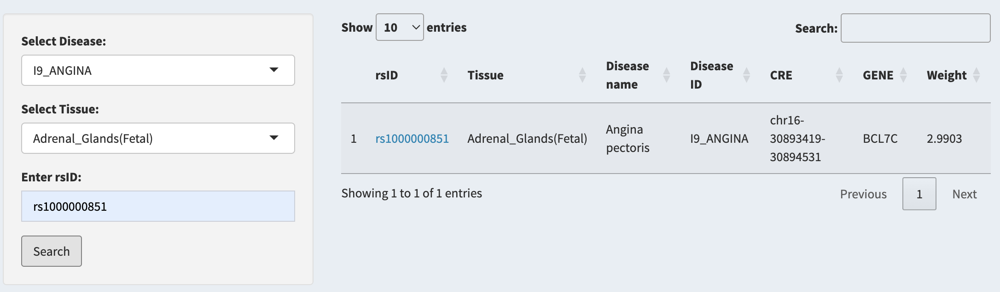
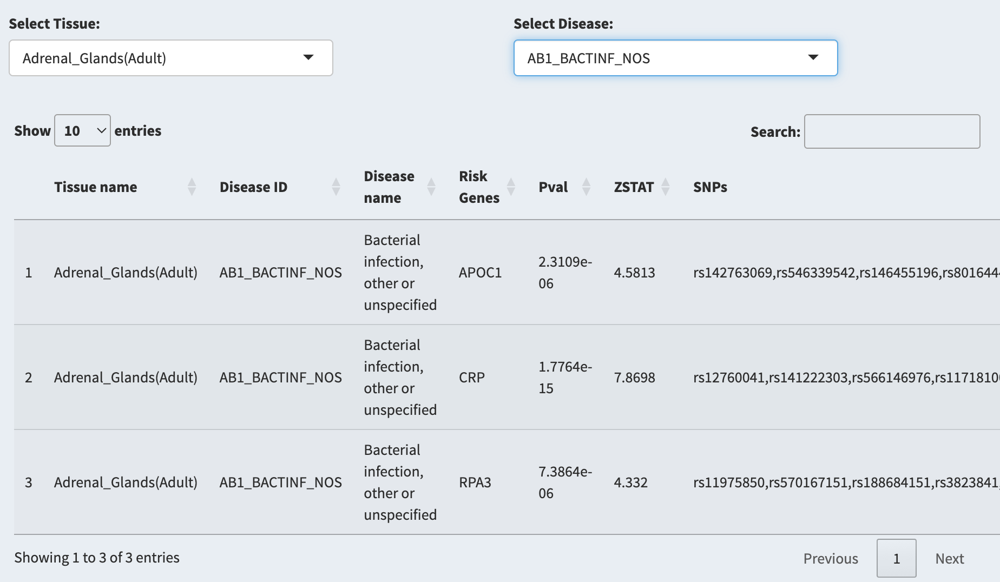
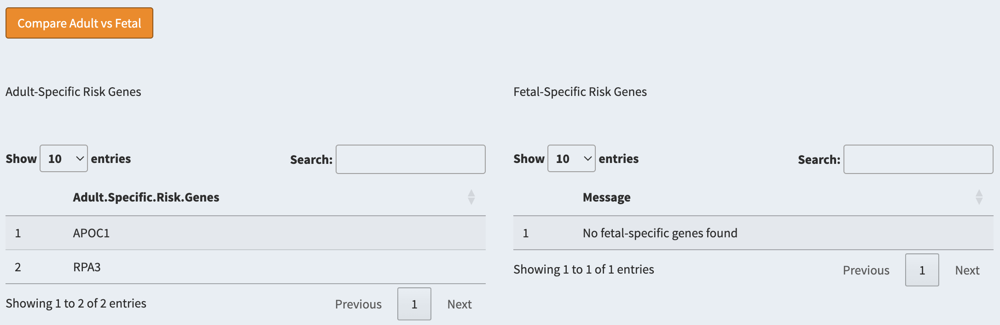
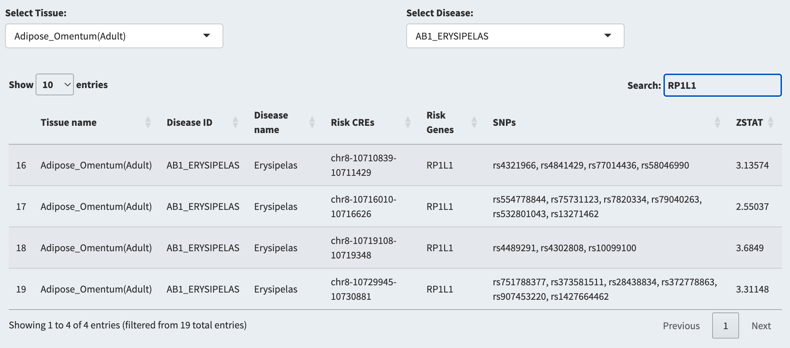
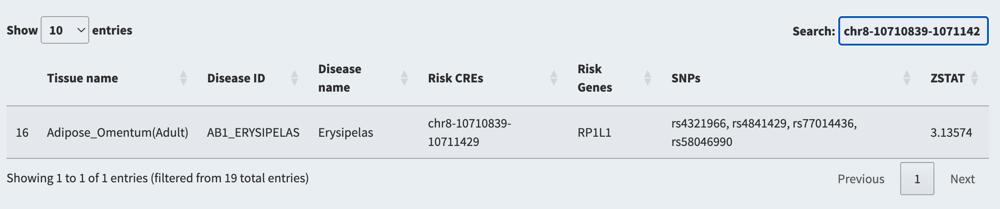
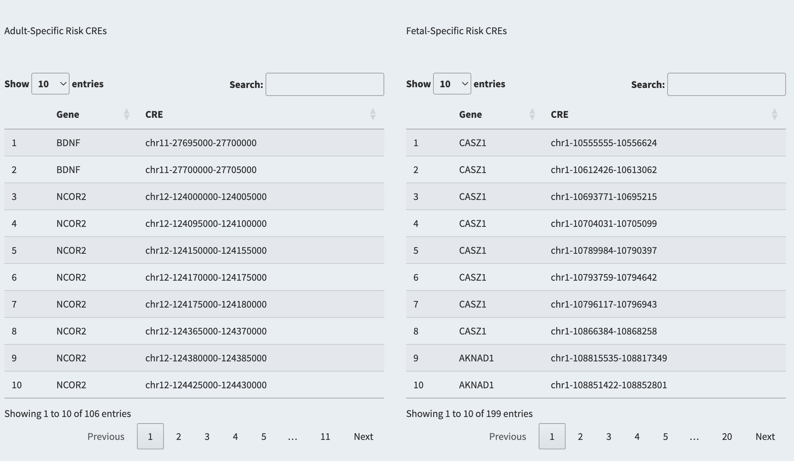
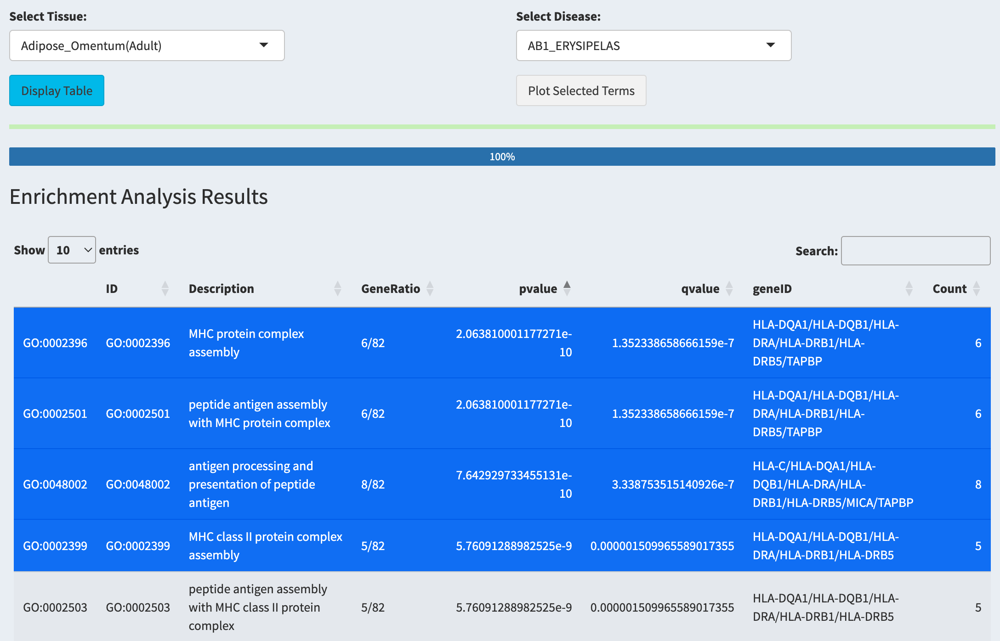
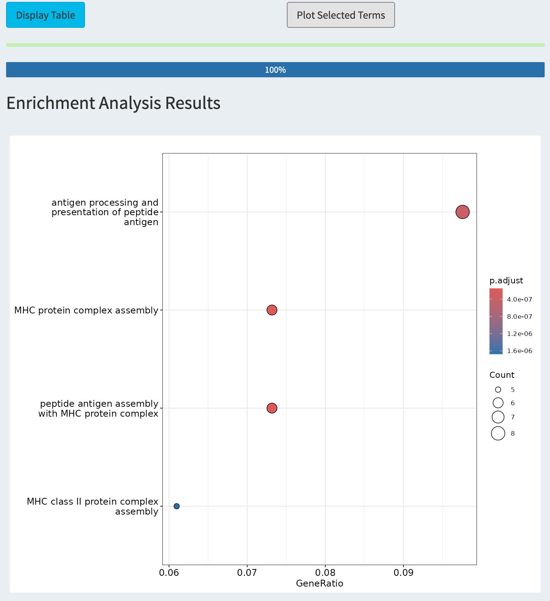
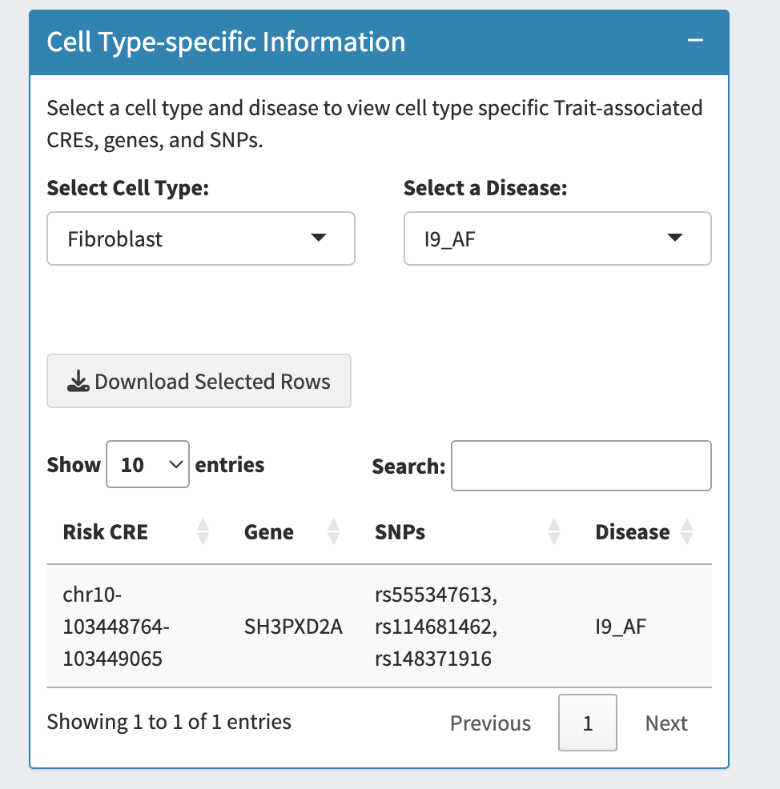

# ❓ Help & User Guide

Welcome to **scRiskdb**. This guide explains how to use the app, what data is included, and how to cite.

------------------------------------------------------------------------

### 🔍 How to Use scRiskdb

-   Annotation,Pathway analysis and Cell types risk association are processed via `SC-VAR`, `clusterProfiler`,`scDRS`

------------------------------------------------------------------------

### SNV Annotation {#sec-snv-annotation}

> #### **`Focus on SNV`**

1.  Select a tissue and disease from the tab.(e.g `Adrenal_Glands(Fetal)`,`I9_ANGINA`)

2.  Enter an `rsID` (e.g., `rs1000000851`) and click **Search**.

3.  View the results, including CRE annotations, gene annotations, Disease Information, and SNP weight (Z_score) under the specific selection.

    {width="500" height="148"}

4.  When There is Result Shows. Click **Download Results** to downloads.

> #### **`SNV to Genes`**

1.  Select a tissue and disease from the drop-down menus.(e.g `Adrenal_Glands(Adult)`,`AB1_BACTINF_NOS`)

2.  View the results, including the disease associated risk genes, the SNP annotations and gene weight (Z_score) under the specific selection.

    {width="500"}

You can also

-   Enter a `Gene symbol name` (e.g., `CRP`) in **Search** box to check the specific gene you are interested in.

-   Click **Download Results** to downloads.

    -   ***Special Function***

        Click `Compare Adult vs Fetal` to explore the risk genes difference between different development stage.

        {width="500"}

> #### **`SNV to cis-Regulatory Elements (CREs)`**

1.  Select a tissue and disease from the dropdown menus.(e.g `Adipose_Omentum(Adult)`,`AB1_ERYSIPELAS`) 2.View the results, including the disease associated risk CREs, the gene that regulated by the CRE as well as the SNP annotations under the specific selection.

You can also

-   Enter a Gene name (e.g., `RP1L1`) in `Search` box to check the gene you are interested in.

    {width="500"}

-   Enter a region (e.g., `chr8-10710839-1071142`) in `Search` box to check the CRE you are interested in.

    {width="500"}

-   Click **Download Results** to downloads.

    -   ***Special Function***

        Click `Compare Adult vs Fetal` to explore the regulatory difference between different development stage.

        {width="500"}

### SNV to Function

> #### **`Pathways`**

1.  Select a disease and tissue from the drop-down menus.

2.  You can choose either the `Display Table` bottom to view the GO results.

    {width="500"}

3.  When results is ready

4.  Choose the terms you are interested in.Then Click `Plot Selected Terms` bottom to Visualize the GO results.

    {width="400"}

> #### **`Aggregate SNV information to trait-associated Cells`**

1.  Select a tissue with any diseases you interested in the tab.

2.  Click **Generate Plot**.

3.  A heatmap will be generated showing the disease-related risk scores across cell types.

    -   Asterisks (\*) mark cell types significantly associated with the selected disease.

    {width="500"}

4.  Use the dropdown to select a specific cell type and explore associated risk genes and CREs.

**Example**:\
Selected: *Left_Ventricle (Adult)* → Cell type: *Fibroblast* → Disease: *I9_AF*

**Output**: - CRE: `chr10-103448764-103449065`\
- GENE: `SH3PXD2A`\
- SNPs: `rs555347613`, `rs114681462`, `rs148371916`

> Gene **SH3PXD2A** has been reported to be associated with atrial fibrillation (AF) in GWAS.

{width="296"}

------------------------------------------------------------------------

### **Analyze your single cell Data** {#sec-analyze-your-single-cell-data}

1.  Choose `.h5ad` file from your device.

2.  Specify the single cell data type (e.g `single cell RNA` or `single cell ATAC`)

    #### **`For RNA Data`**

-   Select a disease and tissue from the tabs, then the system will automatically pool risk data from the database to calculate the disease risk score.

    #### **`For ATAC Data`**

-   You should create your own risk CREs file and upload to server to do the calculation.( you can follow the SC_VAR usage to create the risk file of your own.)

    #### **`For Multiome Data`**

-   You can select one of the Omics data to use.

3.  Click **Submit Analysis**

4.  **Download Results** when it's ready.

------------------------------------------------------------------------

### 📊 Data Sources {#data-sources}

#### **`GWAS`**`: FINNGEN R11`

We selected 317 traits with clear ICD-11 codes, summarized as follows:

| ICD11-Code | Num. | Description                                                                   |
|---------------------|-------------------|--------------------------------|
| M13        | 42   | Diseases of the musculoskeletal system and connective tissue                  |
| K11        | 41   | Diseases of the digestive system                                              |
| I9         | 36   | Diseases of the circulatory system                                            |
| N14        | 28   | Diseases of the genitourinary system                                          |
| O15        | 25   | Pregnancy, childbirth and the puerperium                                      |
| J10        | 23   | Diseases of the respiratory system                                            |
| H7         | 23   | Diseases of the eye and adnexa                                                |
| G6         | 13   | Diseases of the nervous system                                                |
| F5         | 15   | Mental and behavioural disorders                                              |
| E4         | 14   | Endocrine, nutritional and metabolic diseases                                 |
| L12        | 11   | Diseases of the skin and subcutaneous tissue                                  |
| H8         | 10   | Diseases of the ear and mastoid process                                       |
| AB1        | 10   | Certain infectious and parasitic diseases                                     |
| C3         | 8    | Neoplasms, from cancer register                                               |
| ST19       | 6    | Injury, poisoning and certain other consequences of external causes           |
| CD2        | 6    | Neoplasms from hospital discharges                                            |
| D3         | 4    | Diseases of the blood and blood-forming organs and immune mechanism disorders |
| Z21        | 1    | Factors influencing health status and contact with health services            |
| R18        | 1    | Symptoms, signs and abnormal clinical and laboratory findings, NEC            |

#### **`Single-Cell Atlas Data`**`:`

We included single-cell data with atlas level, summarized as follows:

-   **sci-ATAC-seq data of human adult tissues**, GEO: GSE184462, GEO: GSE160472, dbGaP: phs001961, dbGaP: phs002204

-   **sci-ATAC-seq data of human fetal tissues**, dbGaP: phs002003

------------------------------------------------------------------------

## ❓ FAQ (Frequently Asked Questions)

### 🔍 Searching & Interpreting Results

**Q: What should I do if I cannot find my rsID in the SNV search?**\
**A:** Make sure the rsID is correctly formatted (e.g., `rs123456`). If no result appears, the SNP may not be present in the selected tissue or disease context. And do not click Downloads bottom when there is no results,It will give you an error.

**Q: Can I search for a gene instead of an rsID?**\
**A:** Yes. In the SNV-to-Gene and SNV-to-CRE modules, you can search by gene symbol (e.g., `TP53`) to explore disease-associated regulatory mechanisms linked to that gene.

**Q: What does the ZSTAT/Weight represent in the results?**\
**A:** The ZSATA or the Weight is the Z score calculated based on P-values reflects the association strength of the SNP, gene or CRE with the selected disease under the specified tissue context.

------------------------------------------------------------------------

### 🧬 Analyzing My Own Data

**Q: What input formats are supported for uploading single-cell data?**\
**A:** Currently, `.h5ad` files (AnnData format) are supported for RNA, ATAC, and multiome datasets.

**Q: How can I generate a custom CREs file for ATAC data analysis?**\
**A:** You can follow the SC-VAR usage guide to identify trait-relevant CREs based on your dataset and upload the result to scRiskdb for risk cell score calculation.

**Q: Why the number of GO terms are more than expected?**\
**A:** The GO enrichment analysis is performed directly using the `clusterProfiler` package based on the risk genes identified in the database. To provide users with greater flexibility in exploring the data, we intentionally apply a lenient p-value cutoff during the analysis. This approach ensures a broader range of GO terms are retained so that users can later choose those most biologically relevant for plotting.

Note: The larger number of GO terms does not indicate false positives or a system error. Instead, it is a design choice aimed at preserving a wider selection pool for downstream visualization and interpretation.

**Q: Is multiome data supported?**\
**A:** Yes. You can select either RNA or ATAC modality from your multiome file for analysis.

------------------------------------------------------------------------

### 📊 Data & Methods

**Q: What methods are used to annotate risk SNPs and genes?**\
**A:** scRiskdb integrates `SC-VAR:sce-MAGMA` for variant annotation, `clusterProfiler` for pathway enrichment, and `scDRS:sceDRS` for cell-type level risk assessment.

**Q: Can I compare fetal and adult tissues?**\
**A:** Yes. Some modules include a "Compare Adult vs Fetal" function to visualize developmental stage-specific differences.But the organs name should maps or it will give you the data you selected on the general exploration part.

------------------------------------------------------------------------

### 💾 Export & Citation

**Q: Can I download the results?**\
**A:** Yes, most modules include a **Download Results** button to export tables in `.csv` format.

**Q: How should I cite scRiskdb?**\
**A:** Gefei Zhao, Binbin Lai. *SC-VAR: a computational tool for interpreting polygenic disease risks using single-cell epigenomic data*, Briefings in Bioinformatics, 2025.

------------------------------------------------------------------------

### 🛠 Troubleshooting

**Q: The page freezes or crashes during analysis. What should I do?**\
**A:** Try reloading the page and double-checking your input file format and size. Large data sets may take longer to process. For issues that persist, find in the contact page.

**Q: Some traits have no results under certain tissues. Is this normal?**\
**A:** Yes. Not all traits are associated with all tissues or cell types. Risk association depends on the presence of trait-relevant SNPs or regulatory elements in the selected context.

**Q: My uploaded file doesn't trigger any result. What could be wrong?**\
**A:** Please ensure your `.h5ad` file is formatted correctly and contains relevant metadata such as gene expression (for RNA) or peak accessibility (for ATAC).And do not upload file larger than 10GB.

------------------------------------------------------------------------

#### 📌 Citation {#citation}

-   Gefei Zhao, Binbin Lai.*SC-VAR: a computational tool for interpreting polygenic disease risks using single-cell epigenomic data*, Briefings in Bioinformatics,2025.
-   Zhang, Hou, et al. *Polygenic enrichment distinguishes disease associations of individual cells in single-cell RNA-seq data*, Nature Genetics, 2022.
-   Yu G, Wang L, Han Y and He Q. *clusterProfiler: an R package for comparing biological themes among gene clusters.* OMICS: A Journal of Integrative Biology, 2012.

------------------------------------------------------------------------
