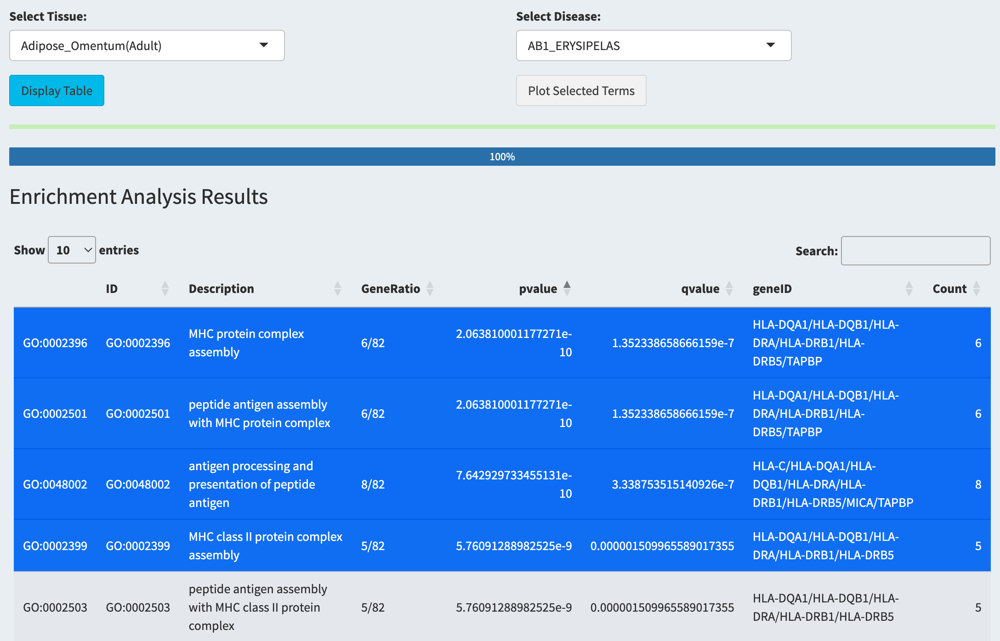
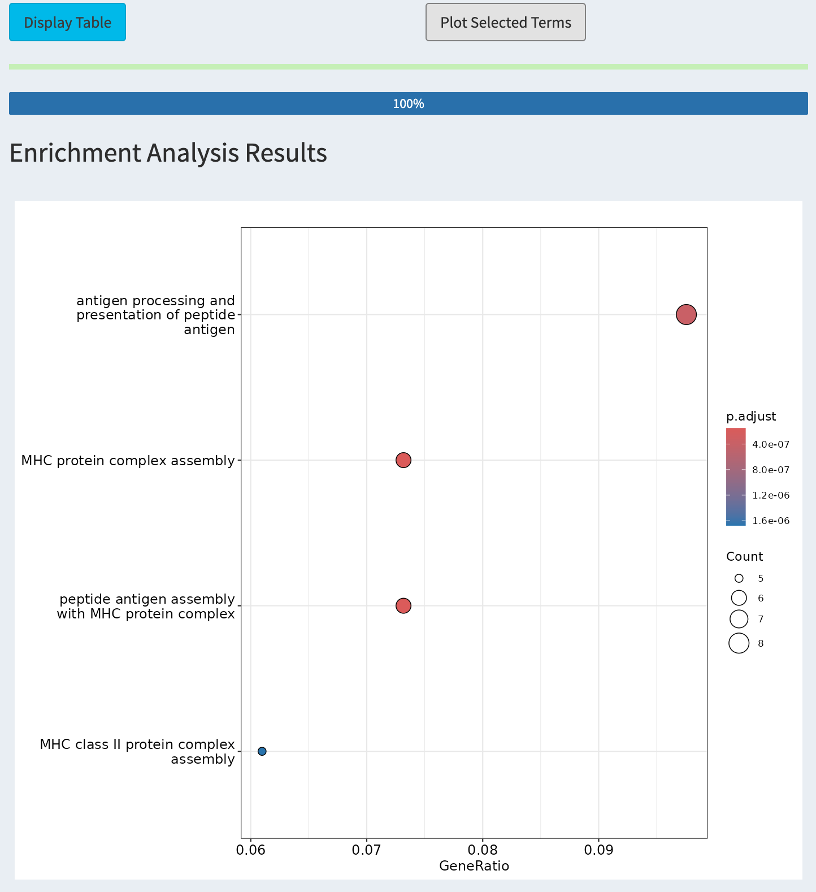
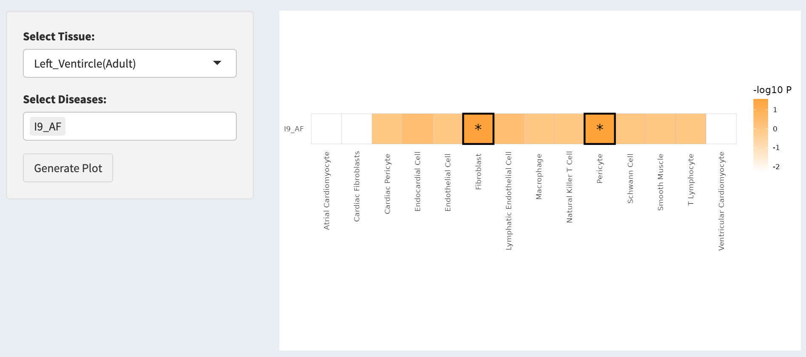
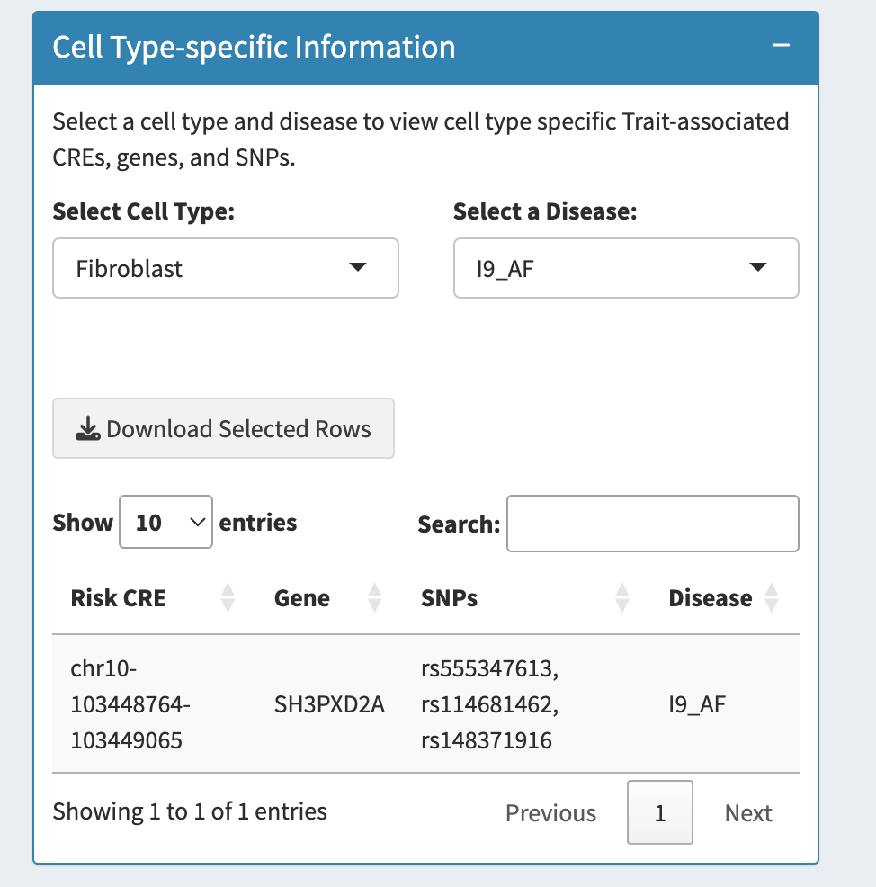

### SNV to Function (📊 Pathways & Critical Cells)

> #### **`Pathways`**

1.  Select a disease and tissue from the drop-down menus.

2.  You can choose either the `Display Table` bottom to view the GO results.

    {width="500"}

3.  When results is ready

4.  Choose the terms you are interested in.Then Click `Plot Selected Terms` bottom to Visualize the GO results.

    {width="400"}

> #### **`Aggregate SNV information to trait-associated Cells`**

1.  Select a tissue with any diseases you interested in the tab.

2.  Click **Generate Plot**.

3.  A heatmap will be generated showing the disease-related risk scores across cell types.

    -   Asterisks (\*) mark cell types significantly associated with the selected disease.

    {width="500"}

4.  Use the dropdown to select a specific cell type and explore associated risk genes and CREs.

**Example**:\
Selected: *Left_Ventricle (Adult)* → Cell type: *Fibroblast* → Disease: *I9_AF*

**Output**: - CRE: `chr10-103448764-103449065`\
- GENE: `SH3PXD2A`\
- SNPs: `rs555347613`, `rs114681462`, `rs148371916`

> Gene **SH3PXD2A** has been reported to be associated with atrial fibrillation (AF) in GWAS.

{width="296"}
