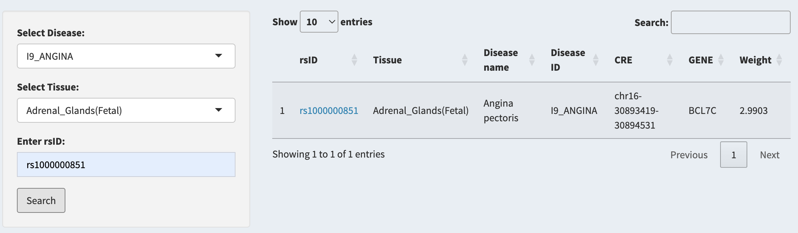

### SNV Annotation {#sec-snv-annotation}

> #### **`Focus on SNV`**

1.  Select a tissue and disease from the tab.(e.g `Adrenal_Glands(Fetal)`,`I9_ANGINA`)

2.  Enter an `rsID` (e.g., `rs1000000851`) and click **Search**.

3.  View the results, including CRE annotations, gene annotations, Disease Information, and SNP weight (Z_score) under the specific selection.

    {width="500" height="148"}

4.  When There is Result Shows. Click **Download Results** to downloads.
